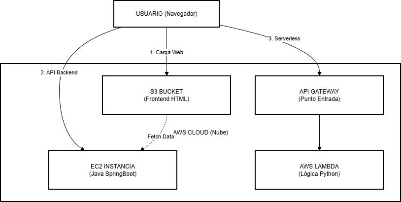

# Taller de Arquitectura y Despliegue de Sistemas
**Curso:** Arquitectura de sofware
**Universidad de Antioquia**

---

## 1. Descripción General del Sistema
Este proyecto consiste en la implementación de un **Sistema Gestor de Tareas** diseñado para demostrar y comparar tres patrones de arquitectura de software modernos utilizando Amazon Web Services (AWS). El sistema permite la creación y visualización de tareas mediante una interfaz web desacoplada, interactuando con servicios de backend y funciones serverless.

El objetivo principal fue evidenciar la transición desde un entorno de desarrollo local hacia un despliegue productivo en la nube, aplicando principios de ingeniería de software (SOLID, DRY) y utilizando infraestructura gestionada.

---

## 2. Enlaces de Despliegue y Pruebas
A continuación se presentan los accesos directos para validar los componentes desplegados.

###  Arquitectura Distribuida (Frontend en S3 + Backend en EC2)
Esta es la arquitectura recomendada para producción moderna. El frontend se sirve como sitio estático y consume la API del servidor.
* **Aplicación Web (Frontend S3):** [http://frontend-taller-arquitectura.s3-website-us-west-2.amazonaws.com/](http://frontend-taller-arquitectura.s3-website-us-west-2.amazonaws.com/)

###  Arquitectura Monolítica (Todo en EC2)
Despliegue clásico donde el servidor de aplicaciones (Tomcat) sirve tanto la API como los archivos estáticos HTML/JS.
* **Aplicación Completa (EC2):** [http://54.68.215.104:8080/](http://54.68.215.104:8080/)
* **Health Check Backend:** [http://54.68.215.104:8080/tareas/health](http://54.68.215.104:8080/tareas/health)

###  Arquitectura Serverless (Punto 3)
Función Lambda expuesta vía API Gateway que procesa lógica sin servidores.
* **Prueba API Serverless:** [https://q2guk7r1y0.execute-api.us-west-2.amazonaws.com/default/Api-Serverless-Taller](https://q2guk7r1y0.execute-api.us-west-2.amazonaws.com/default/Api-Serverless-Taller)
*(Prueba agregando `?tarea=Prueba` al final de la URL para ver el procesamiento dinámico)*

> **Nota de Desarrollo:** Durante la fase de construcción local en mi máquina (Windows), se utilizó la ruta `file:///D:/Escritorio/Taller_Arquitectura/frontend/index.html` para validaciones rápidas antes del despliegue.

---

## 3. Diagrama de Arquitectura
El siguiente esquema ilustra la interacción entre los servicios AWS configurados y el flujo de datos:

*(Ver carpeta `/evidencias` para más detalles visuales)*

---

## 4. Análisis Comparativo: Monolito vs. Distribuido

| Criterio | Arquitectura Monolítica (EC2) | Arquitectura Distribuida (S3 + EC2) |
| :--- | :--- | :--- |
| **Despliegue** | **Acoplado:** Un cambio en el frontend requiere recompilar y desplegar todo el JAR del backend. | **Independiente:** Se puede actualizar el frontend en S3 sin tocar el servidor backend. |
| **Rendimiento** | El servidor EC2 gasta CPU sirviendo HTML/CSS/JS, compitiendo con la lógica de negocio. | S3 entrega el contenido estático con latencia optimizada, liberando al EC2 para procesar solo API. |
| **Escalabilidad** | Vertical (Más CPU/RAM a la instancia). | Horizontal (S3 escala infinito automáticamente). |
| **Costos** | Se paga por hora de servidor encendido. | S3 es significativamente más barato para alojar webs. |

**Conclusión:** La arquitectura distribuida demostró ser superior en términos de mantenibilidad y eficiencia de recursos, alineándose mejor con las prácticas modernas de desarrollo cloud.

---

## 5. Principios de Diseño Aplicados (SOLID y DRY)
El código fuente fue refactorizado para cumplir con los requisitos de calidad de software:

1.  **Single Responsibility Principle (SRP - SOLID):**
    * Se separó la lógica de datos de la lógica de control.
    * `TareaController.java`: Solo maneja las peticiones HTTP y respuestas JSON.
    * `TareaService.java`: Contiene la lógica de negocio y la manipulación de la lista de tareas.

2.  **Don't Repeat Yourself (DRY):**
    * En el Frontend (`index.html`), se definió una constante `API_URL` al inicio del script. Esto evita repetir la dirección IP en cada llamada `fetch()`, facilitando el cambio entre `localhost` y la IP pública de AWS con una sola línea de código.

---

## 6. Evidencias de Ejecución
Se ha documentado todo el proceso mediante video y capturas de pantalla.

###  Video de Demostración
El funcionamiento del sistema en sus tres modalidades (S3, EC2 y Lambda) se puede verificar en el siguiente enlace:
**[Ver Video Explicativo en Google Drive](https://drive.google.com/drive/folders/1GmHzwQW8tdFXrvcIJoSPfqNMw6O71-a5?usp=drive_link)**

### Galería de Imágenes
En la carpeta `/evidencias` de este repositorio encontrará:
* Capturas de la configuración de **Security Groups** (Puertos 8080/22).
* Logs de ejecución exitosa en la terminal SSH.
* Configuración del Bucket S3 para acceso público.
* Definición de la función Lambda en Python.

---

## 7. Reflexión y Retos Técnicos
El desarrollo de este taller presentó varios desafíos que fortalecieron el aprendizaje práctico:

1.  **Conectividad y Redes:** Uno de los mayores retos fue entender por qué el sitio no cargaba inicialmente. La solución implicó configurar correctamente las **Inbound Rules** en el Security Group de AWS para permitir tráfico TCP en el puerto 8080 desde `0.0.0.0/0` (Cualquier origen).
2.  **Políticas de S3:** Configurar el bucket para que fuera público requirió aplicar una **Bucket Policy** específica en formato JSON, entendiendo el modelo de permisos de AWS.
3.  **CORS (Cross-Origin Resource Sharing):** Al separar el frontend (S3) del backend (EC2), el navegador bloqueó las peticiones. Se solucionó agregando la anotación `@CrossOrigin("*")` en el controlador de Spring Boot para permitir el acceso desde el dominio de S3.

**Aprendizaje Clave:** La nube abstrae la infraestructura física, pero exige un control riguroso de la seguridad y la configuración de red para que los componentes distribuidos se comuniquen correctamente.